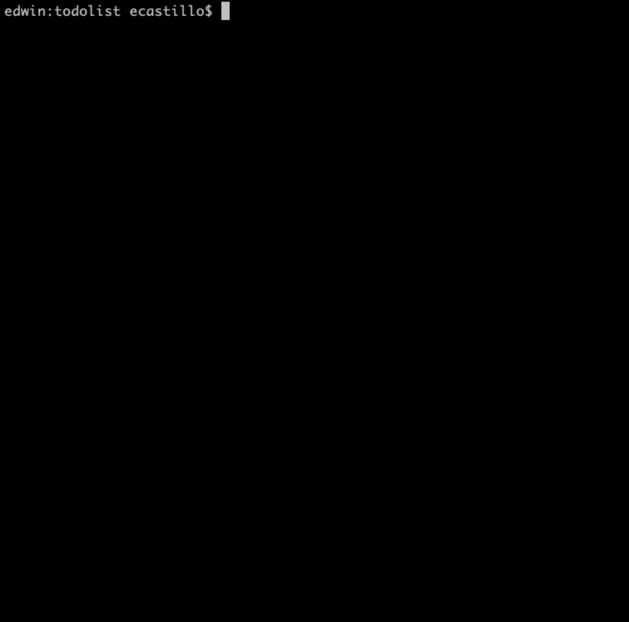

# Create a document and write your task

This is a little program which you'll be able to create your own tasks and save them in a txt file.

# About Me

[Twitter](https://twitter.com/Castilloe2)
[YouTube](https://www.youtube.com/channel/UCOoueCDkfLJZ-h_rpBVYyGw)

# Let's take a look how it works

